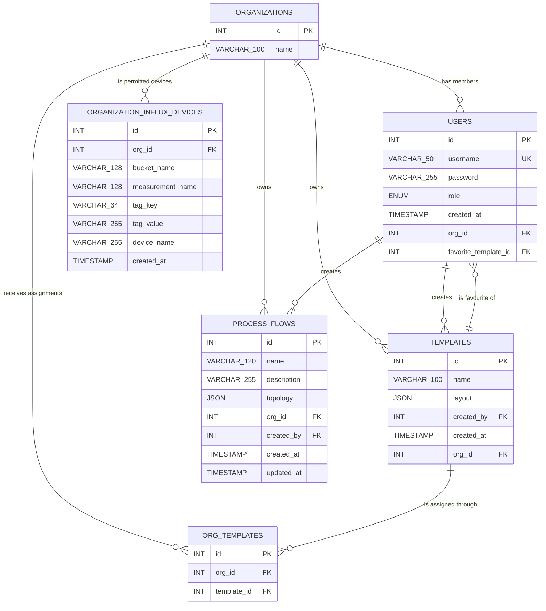
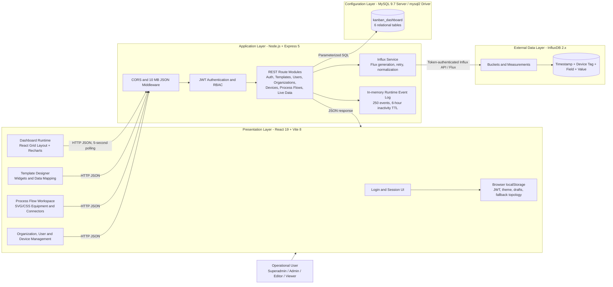
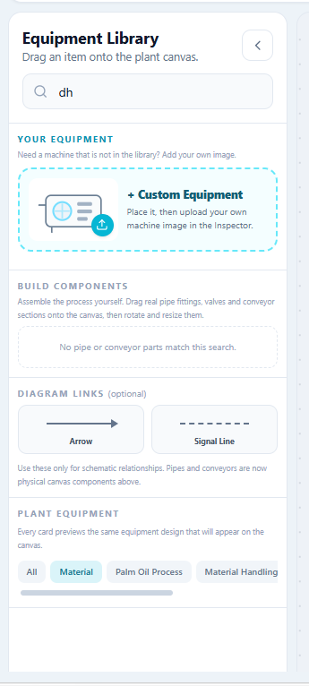
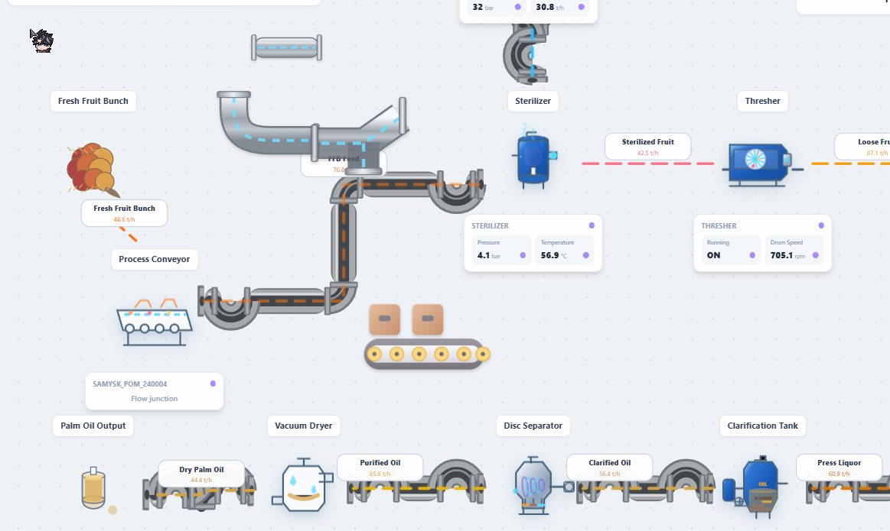
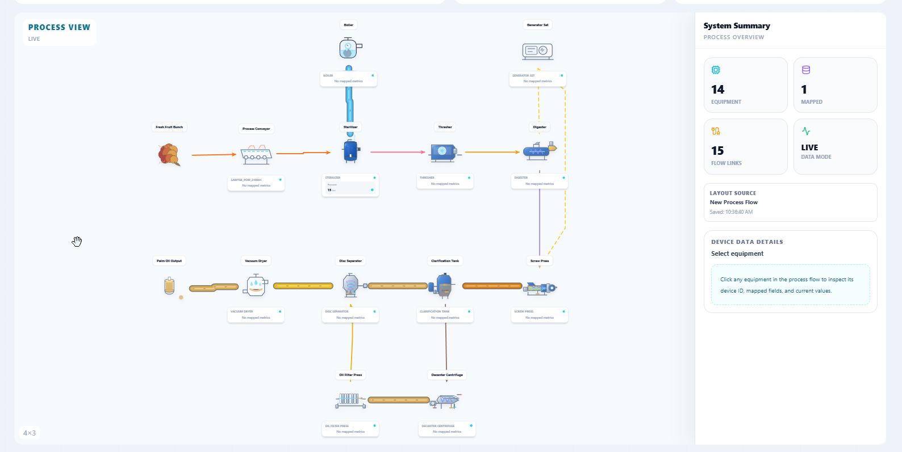
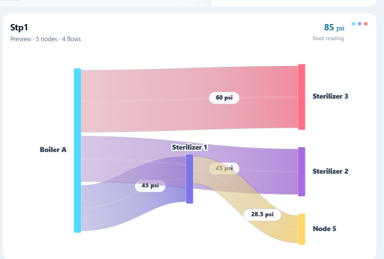
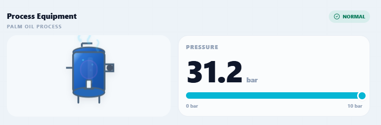
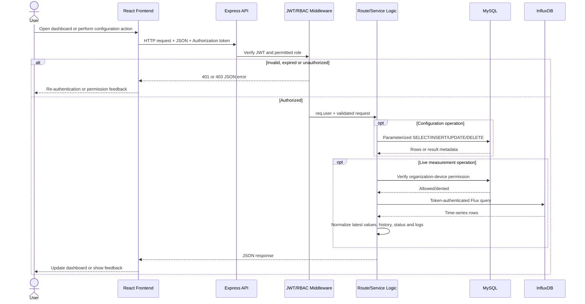

# Database, Architecture and Implementation Documentation

> **Numbering note.** The headings supplied for this report reused `1.1` and `1.2` several times. The sequence below removes the duplication. Replace the chapter number with the number used in the final report, for example `4.1` to `4.7.2`.

This chapter documents the implementation currently contained in the `gridlayout_ui` project and the database dump `dashboard-kanban_dashboard-202609080151.sql`. The system is a React-based industrial monitoring application that stores users, organizations, dashboard templates, access assignments and process-flow definitions in MySQL. Live industrial measurements are retrieved from InfluxDB through an Express backend.

## 1.1 Database Schema

### 1.1.1 Database Overview

The application uses two forms of data storage:

1. **MySQL (`kanban_dashboard`)** stores structured application and configuration data. This includes user accounts, roles, organizations, dashboard templates, template assignments, permitted InfluxDB devices and saved process-flow topologies.
2. **InfluxDB** stores time-series industrial measurements. It is external to the MySQL schema. The application discovers buckets, measurements, device identifiers and fields dynamically through the InfluxDB API.

The attached MySQL dump defines six relational tables:

| No. | Entity | Purpose |
|---:|---|---|
| 1 | `organizations` | Represents a company, department or tenant that owns users, templates, device permissions and process flows. |
| 2 | `users` | Stores login accounts, BCrypt password hashes, roles, organization membership and the user's favourite template. |
| 3 | `templates` | Stores reusable dashboard definitions. The complete grid and widget configuration is stored in the `layout` JSON field. |
| 4 | `org_templates` | Junction table that assigns templates to organizations. |
| 5 | `organization_influx_devices` | Defines which InfluxDB device sources an organization is permitted to access. |
| 6 | `process_flows` | Stores named process-canvas layouts. Equipment, pipes, conveyors and other connections are stored in the `topology` JSON field. |

### 1.1.2 Entity-Relationship Diagram

The following ERD matches the keys and foreign-key actions in the attached SQL dump.



**Figure 1.1: Entity-Relationship Diagram of the Web-Based Industrial Monitoring System**

### 1.1.3 Relationship Description

| Parent entity | Child entity | Cardinality | Foreign key | Implemented delete behaviour |
|---|---|---|---|---|
| `organizations` | `users` | One-to-many | `users.org_id` | No action is declared in the dump; deletion is restricted while matching users remain. The organization route removes users before deleting the organization. |
| `organizations` | `templates` | One-to-many | `templates.org_id` | `ON DELETE CASCADE`. |
| `users` | `templates` | One-to-many | `templates.created_by` | No action is declared; deletion is restricted while created templates reference the user. |
| `organizations` | `templates` | Many-to-many | `org_templates.org_id`, `org_templates.template_id` | Implemented through `org_templates`. The attached dump does not declare cascading deletes on this junction table, so the backend explicitly removes assignment rows during deletion operations. |
| `templates` | `users` | One-to-many | `users.favorite_template_id` | `ON DELETE SET NULL`. Many users may select the same favourite template. |
| `organizations` | `organization_influx_devices` | One-to-many | `organization_influx_devices.org_id` | `ON DELETE CASCADE`. |
| `organizations` | `process_flows` | One-to-many | `process_flows.org_id` | `ON DELETE CASCADE`. |
| `users` | `process_flows` | One-to-many | `process_flows.created_by` | `ON DELETE SET NULL`. A process flow is retained if its creator is removed. |

The `org_templates` table also defines the composite unique constraint `unique_org_template (org_id, template_id)`, preventing the same template from being assigned more than once to the same organization. The `organization_influx_devices` table defines `unique_org_device (org_id, bucket_name, measurement_name, tag_key, tag_value)`, preventing duplicate permission records for the same industrial data source.

## 1.2 Data Dictionary

The following dictionary is based on the latest attached SQL dump, not on an earlier schema file. `PK` means primary key, `FK` means foreign key, `UK` means unique key, and `AI` means auto-increment.

### 1.2.1 Table: `organizations`

| Field | Data type | Null | Default | Constraints | Description |
|---|---|---:|---|---|---|
| `id` | `INT` | No | Auto-generated | PK, AI | Unique identifier for an organization. |
| `name` | `VARCHAR(100)` | Yes | `NULL` | None in attached dump | Display name of the organization. Although nullable in the dump, the backend requires a non-empty name when creating or updating an organization. |

### 1.2.2 Table: `users`

| Field | Data type | Null | Default | Constraints | Description |
|---|---|---:|---|---|---|
| `id` | `INT` | No | Auto-generated | PK, AI | Unique identifier for a user account. |
| `username` | `VARCHAR(50)` | No | None | UK `username` | Unique login name entered on the authentication screen. |
| `password` | `VARCHAR(255)` | No | None | Required | BCrypt password hash. Plain-text passwords are not stored. |
| `role` | `ENUM('superadmin','admin','editor','viewer')` | Yes | `'viewer'` | Enumerated role | Controls access to system functions. |
| `created_at` | `TIMESTAMP` | Yes | `CURRENT_TIMESTAMP` | Automatically initialized | Date and time when the account was created. |
| `org_id` | `INT` | Yes | `NULL` | FK to `organizations.id`; indexed | Organization to which the user belongs. It may be null, particularly for a super administrator. |
| `favorite_template_id` | `INT` | Yes | `NULL` | FK to `templates.id`; indexed; `ON DELETE SET NULL` | Template automatically preferred when the user opens the dashboard. |

### 1.2.3 Table: `templates`

| Field | Data type | Null | Default | Constraints | Description |
|---|---|---:|---|---|---|
| `id` | `INT` | No | Auto-generated | PK, AI | Unique identifier for a dashboard template. |
| `name` | `VARCHAR(100)` | Yes | `NULL` | Backend requires a non-empty value | Human-readable template name. |
| `layout` | `JSON` | Yes | `NULL` | Valid MySQL JSON | Complete dashboard configuration, including grid dimensions, widgets and data mappings. |
| `created_by` | `INT` | Yes | `NULL` | FK to `users.id`; indexed | User who created the template. No delete action is declared in the dump. |
| `created_at` | `TIMESTAMP` | Yes | `CURRENT_TIMESTAMP` | Automatically initialized | Date and time when the template was created. |
| `org_id` | `INT` | Yes | `NULL` | FK to `organizations.id`; indexed; `ON DELETE CASCADE` | Organization that owns the template. A super administrator may create a template with no organization. |

### 1.2.4 Table: `org_templates`

| Field | Data type | Null | Default | Constraints | Description |
|---|---|---:|---|---|---|
| `id` | `INT` | No | Auto-generated | PK, AI | Unique identifier for a template-assignment record. |
| `org_id` | `INT` | Yes | `NULL` | FK to `organizations.id`; part of UK `unique_org_template` | Organization receiving access to the template. The API requires this value even though the dump permits null. |
| `template_id` | `INT` | Yes | `NULL` | FK to `templates.id`; indexed; part of UK `unique_org_template` | Template assigned to the organization. The API requires this value even though the dump permits null. |

### 1.2.5 Table: `organization_influx_devices`

| Field | Data type | Null | Default | Constraints | Description |
|---|---|---:|---|---|---|
| `id` | `INT` | No | Auto-generated | PK, AI | Unique identifier for a device-access assignment. |
| `org_id` | `INT` | No | None | FK to `organizations.id`; `ON DELETE CASCADE`; part of UK `unique_org_device` | Organization permitted to access the data source. |
| `bucket_name` | `VARCHAR(128)` | No | None | Part of UK `unique_org_device` | InfluxDB bucket containing the measurements. |
| `measurement_name` | `VARCHAR(128)` | No | None | Part of UK `unique_org_device` | InfluxDB measurement representing a sensor or measurement group. |
| `tag_key` | `VARCHAR(64)` | No | `'id'` | Part of UK `unique_org_device` | InfluxDB tag column used to identify a device. The application normally uses `id`. |
| `tag_value` | `VARCHAR(255)` | No | None | Part of UK `unique_org_device` | Actual device identifier stored under the selected tag, for example `SAMYSK_POM_240004`. |
| `device_name` | `VARCHAR(255)` | Yes | `NULL` | None | User-friendly device name. If no separate label is supplied, the application uses the device identifier. |
| `created_at` | `TIMESTAMP` | Yes | `CURRENT_TIMESTAMP` | Automatically initialized | Date and time when access to the source was assigned. |

### 1.2.6 Table: `process_flows`

| Field | Data type | Null | Default | Constraints | Description |
|---|---|---:|---|---|---|
| `id` | `INT` | No | Auto-generated | PK, AI | Unique identifier for a saved process flow. |
| `name` | `VARCHAR(120)` | No | None | Required | Human-readable name of the process flow. |
| `description` | `VARCHAR(255)` | Yes | `''` | Optional | Short explanation of the purpose or scope of the process flow. |
| `topology` | `JSON` | Yes | `NULL` | Valid MySQL JSON | Process-canvas definition containing equipment nodes, connections, routing points, canvas metadata and data-source mappings. |
| `org_id` | `INT` | No | None | FK to `organizations.id`; index `idx_process_flows_org`; `ON DELETE CASCADE` | Organization that owns and can access the process flow. |
| `created_by` | `INT` | Yes | `NULL` | FK to `users.id`; index `idx_process_flows_created_by`; `ON DELETE SET NULL` | User who created the flow. |
| `created_at` | `TIMESTAMP` | Yes | `CURRENT_TIMESTAMP` | Automatically initialized | Date and time when the flow was created. |
| `updated_at` | `TIMESTAMP` | Yes | `CURRENT_TIMESTAMP` | `ON UPDATE CURRENT_TIMESTAMP` | Date and time of the most recent database update. |

### 1.2.7 Structure of `templates.layout`

The `layout` field is JSON because dashboard composition varies between templates. The following properties are produced by `TemplateDesigner.jsx`.

| JSON property | Type | Description |
|---|---|---|
| `rows` | Number | Number of rows in the dashboard grid. |
| `cols` | Number | Number of columns in the dashboard grid. |
| `dataSources` | Object keyed by logical data key | Maps each dashboard key to an InfluxDB bucket, measurement, tag and field. |
| `dataSources.<key>.bucket` | String | InfluxDB bucket name. |
| `dataSources.<key>.measurement` | String | InfluxDB measurement name. |
| `dataSources.<key>.tagKey` | String | Device tag column, normally `id`. |
| `dataSources.<key>.tagValue` | String | Device identifier. |
| `dataSources.<key>.id` | String | Compatibility alias for `tagValue`. |
| `dataSources.<key>.field` | String | InfluxDB field or channel containing the required value. |
| `influx` | Object or omitted | Legacy single-source mapping retained for compatibility. New templates use `dataSources`. |
| `channelMap` | Object | Compatibility mapping between dashboard keys and InfluxDB fields. |
| `customDataOptions` | Array | User-defined data keys and their source metadata. |
| `customWidgetTypes` | Array | Definitions for custom reusable widget layouts. |
| `items` | Array | All widgets placed in the grid. |
| `items[].id` | Number/String | Unique widget identifier. |
| `items[].type` | String | Widget renderer type. Current types include `gauge`, `line`, `bar`, `heatmap`, `pie`, `sankey`, `bignumber`, `composite`, `processEquipment`, `processView`, `logs`, `image` and custom-layout forms. |
| `items[].label` | String | Widget title shown in the dashboard. |
| `items[].dataKey` | String | Primary logical data key. |
| `items[].dataKeys` | Array or omitted | Multiple logical data keys used by multi-series or combined widgets. |
| `items[].x`, `items[].y` | Number | Zero-based column and row of the widget. |
| `items[].w`, `items[].h` | Number | Widget width and height in grid cells. |
| `items[].widgetAppearance` | Object | Shared visual options such as corner and accent settings. |
| Widget-specific configuration | Object or omitted | Depending on type: `chartDisplay`, `historyWindow`, `rangeConfig`, `gaugeDisplay`, `bigNumberDisplay`, `logDisplay`, `image`, `pins`, `imageDataMapping`, `sankeyConfig`, `compositeConfig`, `processEquipmentConfig`, `processViewConfig` or `customLayoutConfig`. |

### 1.2.8 Structure of `process_flows.topology`

| JSON property | Type | Description |
|---|---|---|
| `nodes` | Array | Equipment and assembly components placed on the process canvas. |
| `nodes[].id` | String | Unique node identifier. |
| `nodes[].type` | String | Equipment or assembly type from the equipment library. |
| `nodes[].label` | String | User-facing equipment/component label. |
| `nodes[].x`, `nodes[].y` | Number | Canvas coordinates. |
| `nodes[].width`, `nodes[].height` | Number | Rendered component dimensions. |
| `nodes[].rotation` | Number | Rotation in degrees. Assembly controls normally use 90-degree steps. |
| `nodes[].showLabel` | Boolean | Determines whether the node label is displayed. |
| `nodes[].labelOffset` | Object `{x,y}` | Manual offset for the node label. |
| `nodes[].deviceId` | String | Optional mapped industrial device identifier. |
| `nodes[].bindings` | Object | Maps equipment metrics to dashboard data keys. |
| `nodes[].customMetrics` | Array | User-defined metric displays for the equipment. |
| `nodes[].customImageSrc` | String | Uploaded image content/source used by custom equipment. |
| `nodes[].customImageName` | String | File name associated with the custom equipment image. |
| `nodes[].displayMetricIds` | Array | Metrics displayed in the equipment data panel. |
| `nodes[].thresholds` | Object | Warning/danger thresholds for bound metrics. |
| `nodes[].dataDisplayPosition` | String | Position of the metric panel, or `hidden`. |
| `connections` | Array | Pipes, conveyors, arrows and signal lines. |
| `connections[].id` | String | Unique connection identifier. |
| `connections[].source`, `connections[].target` | String or null | IDs of attached source and target nodes. Null values are used by free connections. |
| `connections[].sourceAnchor`, `connections[].targetAnchor` | Object or null | Perimeter anchor definitions for attached connections. |
| `connections[].freeSource`, `connections[].freeTarget` | Object `{x,y}` or omitted | Canvas endpoints for unattached/free connections. |
| `connections[].connectorType` | Enum-like string | `pipeline`, `conveyor`, `arrow` or `line`. |
| `connections[].routingMode` | String | `diagram` for routed connectors or `simple` for a direct line. |
| `connections[].waypoints` | Array of `{x,y}` | User-created bend points along the connection. |
| `connections[].medium` | String | Legacy/process medium value used by existing visual settings. |
| `connections[].label` | String | Optional text displayed on the connection. |
| `connections[].dataKey` | String | Optional live-data key mapped to the connection. |
| `connections[].pipeDesign` | String | Selected pipeline visual design. |
| `connections[].colorOverride` | String | Optional explicit connection colour. |
| `connections[].animateFlow` | Boolean | Enables or disables flow animation. |
| `mode` | String | Process display mode: `live`, `hybrid` or `fake`. |
| `canvas` | Object `{width,height}` | Logical dimensions of the process canvas. |
| `dataSources` | Object | Live-data mappings available to process equipment and connections. |
| `templateId` | Number/null | Associated dashboard template, when applicable. |
| `processFlowId` | Number/null | Associated saved process flow. |
| `savedAt` | ISO 8601 String | Client-side save time included in the topology payload. |

### 1.2.9 Logical InfluxDB Point Schema

InfluxDB is schema-on-write, so its sensor fields are not defined in the MySQL dump and may differ by device. The application works with the following logical point structure:

| Element | InfluxDB type | Description |
|---|---|---|
| Bucket | Container | Logical time-series database selected through `INFLUX_BUCKET` or the super-administrator interface. |
| `_measurement` | String | Measurement group, for example a pressure or temperature measurement. |
| `id` or configured tag key | Tag/String | Device identifier used to filter records. |
| `_field` | String | Sensor channel or measured property. |
| `_value` | Dynamic scalar | Recorded sensor value. Dashboard numeric widgets convert numeric values before rendering. |
| `_time` | Timestamp | UTC timestamp of the measurement. |

## 1.3 System Architecture Diagram

### 1.3.1 Architecture Overview

The system follows a three-tier web architecture with an external time-series service. The React frontend is responsible for interaction and visualization. The Express backend exposes REST endpoints, validates JWTs, enforces roles and organization boundaries, and coordinates queries to MySQL and InfluxDB. MySQL stores configuration data, while InfluxDB stores industrial measurements.



**Figure 1.2: System Architecture of the Web-Based Industrial Monitoring System**

### 1.3.2 Technology by Layer

| Layer | Technologies | Responsibilities |
|---|---|---|
| Client/presentation | React 19, React DOM, Vite 8, Tailwind CSS 3, Lucide React | Screen rendering, navigation, forms, validation feedback, responsive layout and process-canvas interaction. |
| Dashboard visualization | React Grid Layout, Recharts, custom SVG/CSS widget renderers | Grid placement and resizing; charts, gauges, Sankey flow, image overlays, process equipment and process-view rendering. |
| Client session | Browser `localStorage`, Fetch API | Stores JWT/role/session metadata, theme, page drafts and compatibility copies of process topology. Performs REST calls. |
| Server/API | Node.js, Express 5, CORS, dotenv | Hosts JSON endpoints, parses requests, returns responses and provides a health endpoint. |
| Security | JSON Web Token, BCrypt, custom middleware | Verifies login passwords, issues one-day JWTs, checks roles and restricts records by organization. |
| Relational persistence | MySQL, `mysql2` | Stores users, organizations, templates, assignments, device permissions and process flows. |
| Time-series integration | InfluxDB 2.x, `@influxdata/influxdb-client`, Flux | Discovers metadata and retrieves latest/history values for mapped industrial channels. |

### 1.3.3 Current Deployment Topology

In development, Vite serves the frontend at `http://localhost:5173` and Express serves the API at `http://localhost:5000`. The frontend currently uses hard-coded `http://localhost:5000` URLs. CORS middleware allows the separately hosted Vite frontend to call Express. Express connects to MySQL and InfluxDB using values loaded from the root `.env` file.

The source currently uses state-driven page selection in `App.jsx`. Although React Router is installed and a small `routes.jsx` file exists, `main.jsx` renders `App` directly; therefore, the main application navigation is not presently URL-route driven.

## 1.4 Frontend Implementation

### 1.4.1 Frontend Structure

The frontend is divided into page-level modules, shared components, widget renderers and process visualization components. `App.jsx` selects the active page and wraps protected functions in `ProtectedRoute`. `Layout.jsx` supplies the shared navigation. `WidgetRenderer.jsx` selects the correct visualization component for each saved widget type.

The implemented widget library includes Gauge, Line, Bar, Heatmap, Pie, Sankey, Stat, Composite, Process Equipment, Process View, Events & Alarms and Interactive Process Image. Composite presets include Stat + Line, Stat + Area, Stat + Gauge, Stat + Linear Gauge, Gauge + Line, Stat + Bar and Stat + Pie.

### 1.4.2 Module Evidence and Requirement Fulfilment

| Module / screen | Main source files | Implemented functions | Requirement fulfilled |
|---|---|---|---|
| Authentication | `src/pages/Login.jsx`, `src/components/ProtectedRoute.jsx`, `src/utils/sessionAuth.js` | Validates input, submits credentials, stores JWT and role information, blocks protected pages, monitors token expiry, opens a re-authentication modal and retries a failed authorized request once. | USR01, USR02, FR01, FR02. |
| Dashboard runtime | `src/pages/Dashboard.jsx`, `src/pages/DashboardWorkspace.jsx`, `src/components/WidgetRenderer.jsx` | Opens assigned templates in tabs, renders the saved responsive widget grid, supports time-range selection and fullscreen mode, retrieves live/history data every five seconds and retains last-known-good values during temporary failures. | USR07, USR08, FR03, FR09 and FR10. The implemented transport for FR09 is REST polling rather than WebSocket. |
| Template management | `src/pages/TemplateList.jsx` | Lists templates available to the signed-in organization, searches templates, opens dashboards, selects a favourite, deletes permitted templates and allows super administrators to assign templates to organizations. | USR04, USR05, FR04, FR06 and FR10. |
| Template builder/editor | `src/pages/TemplateBuilder.jsx`, `src/pages/TemplateEditor.jsx`, `src/pages/TemplateDesigner.jsx` | Creates configurable grid dimensions, adds/edits/removes/resizes widgets, configures appearance, creates reusable custom widgets and maps logical data keys to InfluxDB sources. | USR04, USR06, USR08, FR03, FR04, FR05, FR07 and FR10. |
| Interactive image editor | `src/pages/ImageWidgetEditor.jsx`, `src/widgets/ImageWidget.jsx`, `src/widgets/ImageOverlayCanvas.jsx` | Uploads a process image, places mapped pins/overlays and displays industrial values in an image-based context. | FR03 and FR07; directly supports Project Objective ii. |
| Sankey editor and widget | `src/pages/SankeyFlowEditor.jsx`, `src/widgets/SankeyWidget.jsx` | Creates nodes and flow links, configures units/values/data sources, supports flow direction, and renders proportional flow paths at different widget sizes. | USR08 and FR03; supports contextual representation of process relationships. |
| Process Flow Workspace / Plant Simulator | `src/pages/ProcessFlowWorkspace.jsx`, `src/pages/ProcessSimulator.jsx`, `src/process/*` | Creates, renames, duplicates, deletes and saves process flows; places equipment; draws pipes, conveyors, arrows and lines; attaches endpoints; adds/removes bend points; supports branches, sizing, rotation, labels and animations; binds equipment to data. | Project Objective ii. A dedicated process-flow functional requirement should be added to the requirements chapter because FR01-FR10 do not fully describe this major module. |
| Process View and Process Equipment widgets | `src/widgets/ProcessViewWidget.jsx`, `src/widgets/ProcessEquipmentWidget.jsx` | Reuses saved process-flow/equipment visual definitions within dashboard widgets and renders bound measurements in preview and runtime displays. | FR03, FR07 and FR10; supports Project Objective ii. |
| Organization and user management | `src/pages/ManageOrganization.jsx` | Super administrators manage organizations; super administrators and admins create users and assign permitted roles; admins are restricted to users in their own organization. | USR02, USR03, FR02 and FR06. |
| Device management | `src/pages/DeviceManagement.jsx` | Discovers InfluxDB buckets, measurements, device IDs and fields; assigns an exact source to an organization; groups and removes access assignments. | FR02, FR07, FR08 and FR09. |

### 1.4.3 Screenshot Evidence

Each final screenshot should show the browser content clearly, use one consistent theme, hide unrelated desktop elements and include a caption. Use screenshots captured from the final tested build rather than design mock-ups.

#### (a) Login and Authentication

**[Insert final screenshot of the Login screen here.]**

**Figure 1.3: Login and Authentication Screen**

The login screen accepts a username and password and sends them to the backend for verification. Successful authentication stores a JWT, user role, organization details and favourite-template ID in browser storage. The protected-route component then restricts screens according to the role. Invalid credentials and server failures are displayed as user-readable messages. This fulfils USR01, USR02, FR01 and FR02.

#### (b) Template Management

**[Insert final screenshot of the Template Management screen here.]**

**Figure 1.4: Dashboard Template Management Screen**

This screen allows authorized users to view available templates and open them as dashboards. A user can select a favourite template, while a super administrator can assign templates to organizations. Administrators and super administrators can create, update and delete templates subject to backend authorization. This fulfils USR04, USR05, FR04, FR06 and FR10.

#### (c) Template Builder and Widget Configuration

**[Insert final screenshot showing the grid editor and widget configuration panel here.]**

**Figure 1.5: Configurable Dashboard Template Builder**

The Template Builder provides a graphical interface for changing grid dimensions and adding, moving, resizing, editing and deleting widgets without programming. Data-source controls map logical keys to an InfluxDB bucket, measurement, device ID and field. The saved configuration is serialized into `templates.layout`. This fulfils USR06, USR08, FR03, FR05, FR07 and Project Objective i.

#### (d) Process Equipment Library



**Figure 1.6: Equipment and Process Component Library**

The library groups custom equipment, process assembly components, optional diagram links and plant equipment. The search facility filters available equipment and components. Users can drag equipment onto the canvas and use the same equipment visual renderer in the library and process canvas. For the final report, recapture this figure with the search field empty so the available components are visible.

#### (e) Process Flow Workspace



**Figure 1.7: Interactive Plant Process Simulator**

The process canvas allows equipment to be positioned and connected using pipeline, conveyor, arrow and signal-line connectors. Connections may be attached to equipment ports or used as free canvas connectors. Users can edit routes and bend points, reverse direction, configure labels and enable visual flow animation. Saved topology is persisted in `process_flows.topology`, with a local-storage compatibility copy. This implements the contextual and process-oriented environment required by Project Objective ii.

#### (f) Dashboard Process View



**Figure 1.8: Dashboard Process View with Equipment and Flow Connections**

The Process View widget presents the saved process-flow layout as a dashboard visualization and includes the equipment, connections, mapped metric cards and animations used by the simulator. This allows operators to relate live measurements to physical process context instead of reading isolated values.

#### (g) Sankey Widget



**Figure 1.9: Sankey Flow Visualization**

The Sankey widget represents quantities moving between process nodes. Path widths are based on configured or mapped values, and the renderer adapts labels and spacing to the available widget size. The editor can bind individual flows to InfluxDB data sources, helping users interpret distribution and process relationships.

#### (h) Process Equipment Widget



**Figure 1.10: Process Equipment Widget with Mapped Measurement**

The Process Equipment widget combines the same equipment visual used in the process simulator with a bound industrial measurement, unit, operating range and status. This improves consistency between widget configuration, preview and runtime rendering and fulfils image/equipment-based data mapping under FR07.

#### (i) Organization, User and Device Management

**[Insert one screenshot of Organization/User Management and one screenshot of Device Management here.]**

**Figure 1.11: Role and Organization Management**  
**Figure 1.12: Organization Device-Access Management**

These screens provide the administrative controls required for multi-organization use. Super administrators manage organizations, template assignments and device permissions. Administrators manage editor and viewer accounts within their own organization. Device access is stored as an exact InfluxDB bucket, measurement, tag key and tag value, preventing ordinary users from requesting arbitrary industrial devices.

## 1.5 Backend Implementation

### 1.5.1 Backend Components

The backend is implemented in Node.js using Express. `server.js` initializes CORS, JSON and URL-encoded request parsing with a 10 MB limit, mounts all route modules, defines `/health`, installs a final JSON error handler and listens on port 5000 unless `PORT` is configured.

| Component | Source | Responsibility |
|---|---|---|
| Server bootstrap | `server.js` | Initializes middleware, mounts route modules, exposes health status and starts the HTTP server. |
| MySQL connection | `config/db.js` | Creates the `mysql2` connection and provides the Promise-based `dbQuery` helper. |
| InfluxDB connection | `config/influx.js` | Creates the InfluxDB client using URL, token, organization, bucket and timeout environment variables. |
| Authentication middleware | `middleware/auth.js` | Accepts a raw JWT or `Bearer` token, verifies it, checks optional role lists and attaches the decoded payload to `req.user`. |
| Authentication route | `routes/authRoutes.js` | Looks up a user, compares the BCrypt password and issues a one-day JWT. |
| Template routes | `routes/templateRoutes.js` | Performs template CRUD, retrieves role-filtered templates and manages favourite/default templates. |
| Organization routes | `routes/organizationRoutes.js` | Performs organization CRUD, template assignment and synchronization of template device sources. |
| User routes | `routes/userRoutes.js` | Creates users, returns role-filtered user lists and updates user roles/organizations. |
| Device routes | `routes/deviceRoutes.js` | Stores and removes organization-to-Influx device permissions and returns allowed devices. |
| Process-flow routes | `routes/processFlowRoutes.js` | Performs organization-scoped CRUD for named process-flow topologies. |
| Influx routes | `routes/influxRoutes.js` | Discovers metadata and produces normalized live/history dashboard responses. |
| Influx service | `services/influxService.js` | Builds Flux queries, retries transient failures, checks organization device access, groups sources and retrieves Sankey/runtime values. |
| Utility functions | `utils/helpers.js` | Escapes Flux strings, validates tag names, parses time windows and normalizes values/layouts. |

### 1.5.2 Backend Request Flow



**Figure 1.13: Backend Authentication, Persistence and Live-Data Sequence**

### 1.5.3 Authentication and Authorization

During login, the backend selects the matching user and organization, compares the submitted password with the stored BCrypt hash and signs a JWT containing `id`, `role`, `org_id`, `org_name` and `favorite_template_id`. The token expires after one day.

Protected routes call `auth()` for any authenticated role or pass a role list such as `auth(["superadmin", "admin"])`. Organization-level restrictions are then applied in SQL queries. For example, a non-superadmin process-flow request includes `WHERE pf.org_id = ?`, and an admin can only manage non-superadmin users belonging to the admin's organization.

### 1.5.4 Persistence Processing

Dashboard layouts and process topologies are serialized with `JSON.stringify` before insertion or update. When returned to the frontend, helper functions parse these values back into JavaScript objects. SQL placeholders (`?`) and parameter arrays are used for database values, reducing SQL injection risk.

The runtime Events & Alarms history is currently held in an in-memory map rather than MySQL. Each stream is limited to 250 entries and removed after six hours without access. Consequently, these generated logs are reset whenever the Node.js server restarts; this should be disclosed as a current system limitation.

### 1.5.5 Backend Endpoint Catalogue

| Method and endpoint | Access | Purpose |
|---|---|---|
| `POST /login` | Public | Authenticate credentials and return a JWT and user context. |
| `GET /health` | Public | Return API health information. |
| `GET /templates` | Authenticated | Return all templates for a superadmin or templates assigned to the user's organization. |
| `POST /templates` | Superadmin, Admin | Create a template. Admin-created templates are automatically assigned to the admin's organization. |
| `PUT /templates/:id` | Superadmin, Admin | Update template name and layout, with organization ownership checks for admins. |
| `DELETE /templates/:id` | Superadmin, Admin | Delete a permitted template and clean assignment/favourite references. |
| `PUT /users/favorite-template` | Authenticated | Set an accessible template as the user's favourite. |
| `GET /default-template` | Authenticated | Return the favourite template or the latest accessible fallback template. |
| `GET /template-assignments` | Superadmin | List organization-template assignments. |
| `POST /assign-template` | Superadmin | Assign a template to an organization and synchronize referenced device sources. |
| `DELETE /template-assignments` | Superadmin | Remove an organization-template assignment. |
| `POST /organizations` | Superadmin | Create an organization. |
| `GET /organizations` | Superadmin, Admin | Return all organizations for a superadmin or the admin's own organization. |
| `PUT /organizations/:id` | Superadmin | Rename an organization. |
| `DELETE /organizations/:id` | Superadmin | Delete an organization using backend cleanup/transaction logic. |
| `POST /users` | Superadmin, Admin | Create a user with an allowed role and BCrypt password hash. |
| `GET /users` | Superadmin, Admin | List users, restricted to the admin's organization where applicable. |
| `PUT /users/:id/role` | Superadmin, Admin | Update a non-superadmin user's role and organization. |
| `GET /process-flows` | Authenticated | List all flows for a superadmin or flows in the user's organization. |
| `GET /process-flows/:id` | Authenticated | Return one accessible process flow. |
| `POST /process-flows` | Superadmin, Admin, Editor | Create an organization-owned process flow. |
| `PUT /process-flows/:id` | Superadmin, Admin, Editor | Update name, description and/or topology. |
| `DELETE /process-flows/:id` | Superadmin, Admin, Editor | Delete an accessible process flow. |
| `GET /influx/allowed-devices` | Superadmin, Admin, Editor | Return device sources available to the signed-in user. |
| `GET /organization-influx-devices` | Superadmin | List stored organization-device assignments. |
| `POST /organization-influx-devices` | Superadmin | Assign one exact bucket/measurement/tag/device source. |
| `DELETE /organization-influx-devices/:id` | Superadmin | Delete one device-assignment row. |
| `POST /organization-influx-devices/bulk-device-ids` | Superadmin | Discover measurements for selected IDs and create permission rows. |
| `POST /organization-influx-devices/bulk-logical` | Superadmin | Assign selected logical equipment groups after server-side discovery. |
| `POST /organization-influx-devices/bulk-remove` | Superadmin | Remove several measurement-level permission rows. |
| `GET /influx/buckets` | Superadmin | Discover available InfluxDB buckets. |
| `GET /influx/logical-devices` | Superadmin | Group related measurements and IDs into logical device records. |
| `GET /influx/measurements` | Superadmin | Discover measurements in a bucket. |
| `GET /influx/device-ids` | Superadmin | Discover unique device IDs across a bucket. |
| `GET /influx/ids` | Superadmin | Discover device IDs for one measurement. |
| `GET /influx/channels` | Superadmin, Admin, Editor | Discover fields/channels; non-superadmins must request an assigned device. |
| `POST /template-live-data` | Authenticated | Validate mapped sources and return normalized latest values, history, live status, Sankey values and runtime logs. |

### 1.5.6 Implementation Consistency Notes

1. The frontend allows an `editor` to open the Template Builder and Template Editor, but `POST /templates` and `PUT /templates/:id` only allow `admin` and `superadmin`. Therefore, an editor can configure a template in the UI but cannot save it through the current backend. Either remove editor access to those screens or add `editor` to the backend write roles with suitable ownership checks.
2. FR09 currently states that real-time data is retrieved using WebSocket. The implemented dashboard instead calls `POST /template-live-data` every five seconds. Either revise FR09 to specify periodic REST updates or implement an actual WebSocket server and client.
3. The `ws` package is installed but no `WebSocket` server/client is connected in the current source.
4. The API base URL is repeated as `http://localhost:5000`. A production-ready version should use a Vite environment variable such as `VITE_API_BASE_URL`.
5. `config/db.js` creates one MySQL connection and does not use `DB_PORT`. A deployment requiring a custom port or higher concurrency should add `port: process.env.DB_PORT` and use a connection pool.

## 1.6 API Integration

### 1.6.1 Integration with Backend Server

The React frontend integrates with the Express backend using the browser Fetch API. JSON request bodies use `Content-Type: application/json`. Protected requests include the JWT in the `Authorization` header. The backend middleware supports both a raw token and a conventional `Bearer <token>` value, although the frontend currently sends the raw token.

#### Example A: Login Request

The login screen sends credentials and handles invalid JSON, non-successful HTTP status codes and network failures.

```jsx
const response = await fetch("http://localhost:5000/login", {
  method: "POST",
  headers: {
    "Content-Type": "application/json",
  },
  body: JSON.stringify({
    username: username.trim(),
    password,
  }),
});

const text = await response.text();
let data = {};

try {
  data = text ? JSON.parse(text) : {};
} catch {
  throw new Error("Server did not return JSON. Please check backend server.");
}

if (!response.ok) {
  throw new Error(data?.error || "Invalid username or password");
}
```

Sample request:

```json
{
  "username": "operator01",
  "password": "example-password"
}
```

Sample successful response:

```json
{
  "token": "<signed-jwt>",
  "role": "viewer",
  "org_id": 2,
  "org_name": "Novaflow Engineering SDN. BHD.",
  "favorite_template_id": 17
}
```

Sample error response with HTTP 401:

```json
{
  "error": "Wrong password"
}
```

#### Example B: Reusable Process-Flow Request Helper

`src/process/processFlowApi.js` centralizes token attachment, JSON parsing and response checking for process-flow CRUD.

```jsx
const request = async (path, options = {}) => {
  const token = localStorage.getItem("token");

  const response = await fetch(`${API_BASE}${path}`, {
    ...options,
    headers: {
      ...(options.body ? { "Content-Type": "application/json" } : {}),
      ...(token ? { Authorization: token } : {}),
      ...(options.headers || {}),
    },
  });

  return parseResponse(response);
};

export const updateProcessFlow = (id, patch) =>
  request(`/process-flows/${id}`, {
    method: "PUT",
    body: JSON.stringify(patch),
  });
```

The `parseResponse` function reads the response body, checks that it contains valid JSON and throws an `Error` using the backend's `error` property whenever `response.ok` is false. The calling screen catches the error and shows feedback through the shared notification system.

#### Example C: Live Dashboard Data and Resilience

The dashboard submits all mapped sources and its selected time range to the backend.

```jsx
const response = await fetch("http://localhost:5000/template-live-data", {
  method: "POST",
  headers: {
    "Content-Type": "application/json",
    Authorization: token,
  },
  body: JSON.stringify({
    dataSources,
    influx: influxConfig,
    channelMap,
    ...timeRequest,
    items: layout?.items || items || [],
  }),
});

const result = await response.json();

if (!response.ok) {
  const error = new Error(
    result?.error || "Failed to retrieve template live data"
  );
  error.transient = Boolean(result?.transient || response.status === 503);
  throw error;
}
```

After a successful response, incoming data is merged with the previous state and cached as the last-known-good snapshot. A temporary InfluxDB timeout does not clear the visible dashboard. The next poll is scheduled five seconds after the current request completes, preventing overlapping requests.

Sample live-data request:

```json
{
  "dataSources": {
    "pressure": {
      "bucket": "SmartMill365",
      "measurement": "PSTR_bar",
      "tagKey": "id",
      "tagValue": "SAMYSK_POM_240004",
      "field": "value"
    }
  },
  "historyWindow": "15m",
  "items": []
}
```

Illustrative response shape produced by the implementation:

```json
{
  "timestamp": "2026-09-08T01:45:12.000Z",
  "liveStatus": {
    "status": "online",
    "message": "Live data is updating normally.",
    "sourceTimestamp": "2026-09-08T01:45:12.000Z",
    "ageSeconds": 3,
    "isFresh": true,
    "returnedFieldCount": 1,
    "expectedFieldCount": 1,
    "missingFields": [],
    "fieldTimestamps": {
      "pressure": "2026-09-08T01:45:12.000Z"
    }
  },
  "dataSources": {
    "pressure": {
      "bucket": "SmartMill365",
      "measurement": "PSTR_bar",
      "tagKey": "id",
      "tagValue": "SAMYSK_POM_240004",
      "field": "value"
    }
  },
  "range": {
    "requested": "15m",
    "aggregateEvery": "10s"
  },
  "data": {
    "pressure": 31.2
  },
  "history": [
    {
      "timestamp": 1788831900000,
      "pressure": 30.8
    }
  ],
  "sankeyValues": {},
  "logs": []
}
```

#### Session Expiry Handling

`installAuthFetchInterceptor()` wraps `window.fetch` for requests that already contain an `Authorization` header. It checks the JWT expiry time before the request, opens the session-expiry modal when necessary, applies the latest token and retries once if the server returns HTTP 401. This centralizes session recovery across protected frontend modules.

#### HTTP Error Handling Convention

| Status | Meaning in this system | Frontend action |
|---:|---|---|
| 400 | Missing/invalid request data or invalid Influx source parameters | Display the backend `error` message and retain the current form. |
| 401 | Invalid or expired JWT | Request re-authentication; retry once after success. |
| 403 | Authenticated user lacks the role, organization ownership or device permission | Display a permission error and do not apply the change. |
| 404 | Requested organization, user, template or process flow does not exist/is unavailable | Display not-found feedback and refresh stale lists where appropriate. |
| 409 | Duplicate assignment | Inform the user that the organization-template/device assignment already exists. |
| 500 | Database, configuration or unexpected server failure | Display a general failure message and log technical details on the server. |
| 503 | Temporary InfluxDB/network failure | Keep last-known-good values and show a delayed-connection warning. |

### 1.6.2 Integration with External APIs

The current implementation integrates with one third-party service: **InfluxDB 2.x**. No hotel, flight, map, payment or other third-party web API is used by this industrial monitoring system.

The InfluxDB credentials remain on the backend. The React frontend never receives the InfluxDB API token and does not call InfluxDB directly. This is important because it prevents users from bypassing organization-device authorization.

#### External API A: Bucket Discovery

| Item | Definition |
|---|---|
| Service | InfluxDB 2.x HTTP API |
| Endpoint | `GET {INFLUX_URL}/api/v2/buckets?org={INFLUX_ORG}` |
| Authentication | `Authorization: Token {INFLUX_TOKEN}` |
| Request format | Query string; no request body |
| Raw response format | JSON |
| Used by | Backend `GET /influx/buckets`, available to super administrators |
| Error handling | 15-second default timeout, one retry for transient HTTP 429/502/503/504 or transient network failures, then configured-bucket fallback where possible |

Illustrative raw InfluxDB response:

```json
{
  "links": {
    "self": "/api/v2/buckets?org=Novaflow"
  },
  "buckets": [
    {
      "id": "0f123456789abcde",
      "orgID": "0a123456789abcde",
      "type": "user",
      "name": "SmartMill365",
      "retentionRules": []
    }
  ]
}
```

The Express route normalizes this to a small frontend response:

```json
{
  "buckets": ["SmartMill365"]
}
```

#### External API B: Flux Query API

| Item | Definition |
|---|---|
| Service | InfluxDB 2.x Query API through `@influxdata/influxdb-client` |
| Effective endpoint | `POST {INFLUX_URL}/api/v2/query?org={INFLUX_ORG}` |
| Authentication | Token supplied when constructing the backend InfluxDB client |
| Request format | Flux query text sent by the official client |
| Raw response format | Annotated CSV streamed and converted by the client to row objects |
| Used for | Measurement discovery, tag/device discovery, field discovery, latest values, historical values and Sankey link values |
| Error handling | Per-query timeout from `INFLUX_TIMEOUT` and retry for transient failures |

Example Flux query used for recent values:

```flux
from(bucket: "SmartMill365")
  |> range(start: -15m)
  |> filter(fn: (r) =>
    r._measurement == "PSTR_bar" and
    r["id"] == "SAMYSK_POM_240004"
  )
  |> filter(fn: (r) => r._field == "value")
  |> last()
```

Illustrative row after the official client parses the InfluxDB response:

```json
{
  "result": "_result",
  "table": 0,
  "_start": "2026-09-08T01:30:00Z",
  "_stop": "2026-09-08T01:45:00Z",
  "_time": "2026-09-08T01:44:57Z",
  "_measurement": "PSTR_bar",
  "id": "SAMYSK_POM_240004",
  "_field": "value",
  "_value": 31.2
}
```

#### Metadata Queries

The backend also uses functions from the InfluxDB `schema` package:

| Flux operation | Purpose | Corresponding application endpoint |
|---|---|---|
| `schema.measurements(...)` | Discover measurement names in a selected bucket. | `GET /influx/measurements` |
| `schema.tagValues(...)` without a measurement predicate | Discover unique device identifiers across a bucket. | `GET /influx/device-ids` |
| `schema.tagValues(...)` with a measurement predicate | Discover device identifiers belonging to one measurement. | `GET /influx/ids` |
| `schema.fieldKeys(...)` | Discover channels/fields for a measurement and optional device. | `GET /influx/channels` |

Before returning data, the backend validates the requested tag column, escapes interpolated Flux strings, checks the `organization_influx_devices` table and groups mappings that share a bucket, measurement, tag key and tag value. This minimizes duplicate queries and enforces tenant isolation.

## 1.7 Recommended Report Corrections Before Submission

1. Change any statement claiming that the current build uses WebSocket to **"the dashboard retrieves near-real-time readings through authenticated REST polling at five-second intervals"**, unless WebSocket is implemented before submission.
2. Add a functional requirement for the Process Flow Workspace, for example: **"The system shall allow authorized users to construct, edit, save and display industrial process flows using configurable equipment, pipelines, conveyors and directional connections."**
3. Add a functional requirement for device authorization, for example: **"The system shall allow a super administrator to assign InfluxDB device sources to organizations and shall prevent users from accessing unassigned sources."**
4. Resolve the editor save-permission mismatch before UAT or document that only admins and superadmins may persist templates.
5. Replace all screenshot placeholders with final screenshots taken after completing UI fixes. Use the same data and template throughout the chapter so the figures tell one coherent implementation story.
6. In the database appendix, state that the supplied SQL file is a schema-only export and does not contain user or sensor records.

